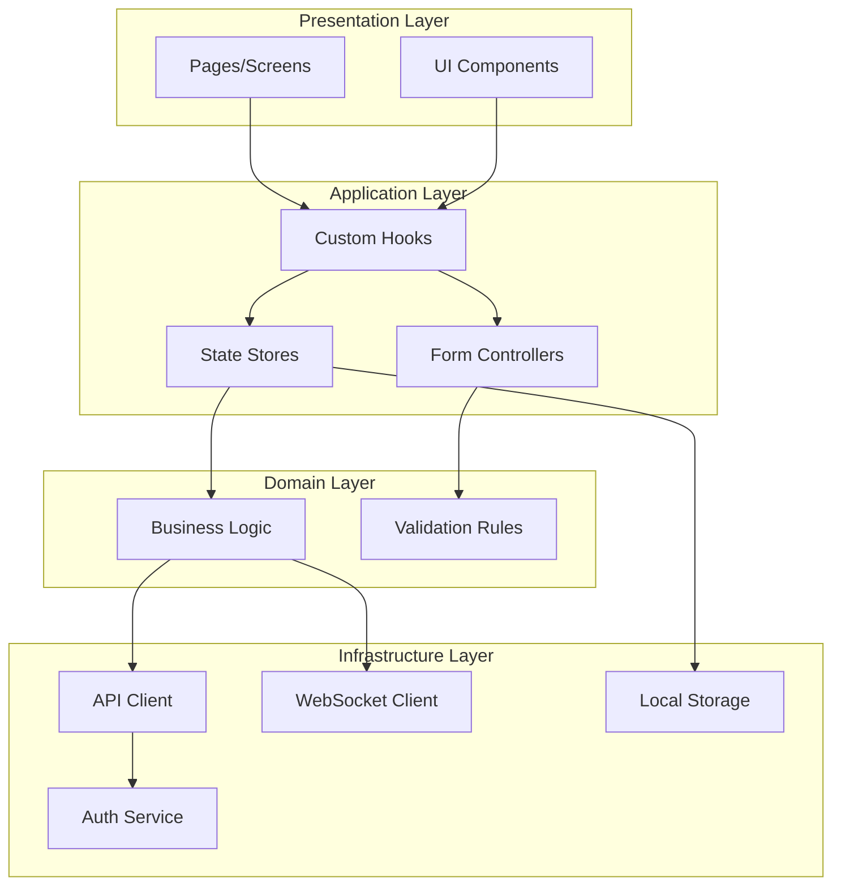
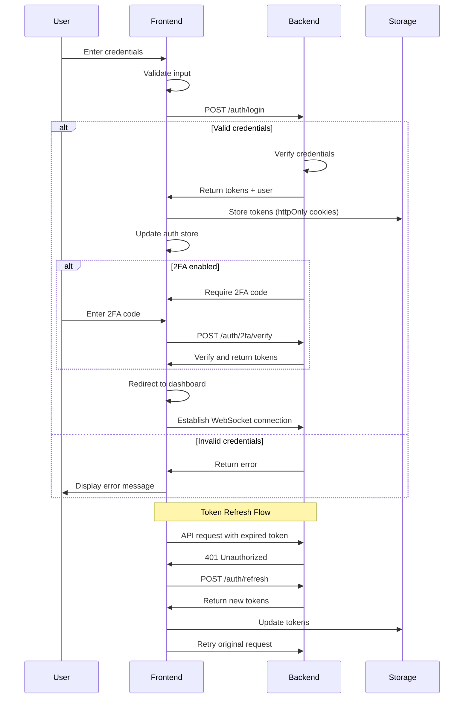
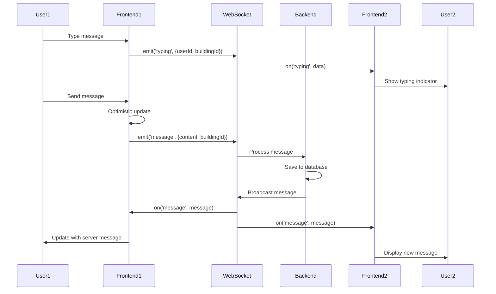

# Design Document: Horizon-HCM Frontend Applications

## Overview

Horizon-HCM is a modern, transparent management platform for residential house committees. This design document specifies the architecture and implementation details for the frontend applications (web and mobile) that interface with the complete backend API running on http://localhost:3001.

### System Context

The frontend applications provide role-based interfaces for:
- House Committee Members (administrative privileges)
- Apartment Owners (financial and voting features)
- Tenants (payment and announcement features)
- System Admins (platform management)

### Technology Stack

**Web Application:**
- React 18 with TypeScript
- Vite (build tool)
- Material-UI v5 (component library)
- React Router v6 (routing)
- Zustand (client state management)
- React Query (server state management)
- Axios (HTTP client)
- Socket.io-client (WebSocket communication)
- React Hook Form + Zod (form management and validation)
- next-intl (internationalization)
- Recharts (data visualization)

**Mobile Application:**
- React Native with TypeScript
- Expo (development platform)
- React Native Paper (component library)
- React Navigation v6 (navigation)
- Zustand (client state management)
- React Query (server state management)
- Axios (HTTP client)
- Socket.io-client (WebSocket communication)
- React Hook Form + Zod (form management and validation)
- Expo Notifications (push notifications)
- Expo Camera (camera access)
- Expo LocalAuthentication (biometric auth)

**Shared Package:**
- TypeScript types and interfaces
- API client configuration
- Business logic utilities
- Validation schemas (Zod)
- Constants and enums
- Date/time utilities (date-fns)


## Architecture

### High-Level Architecture

```mermaid
graph TB
    subgraph "Frontend Applications"
        WEB[Web Application<br/>React + Vite]
        MOBILE[Mobile Application<br/>React Native + Expo]
        SHARED[Shared Package<br/>API Client + Types + Utils]
    end
    
    subgraph "Backend Services"
        API[NestJS REST API<br/>:3001]
        WS[WebSocket Server<br/>Socket.io]
        DB[(PostgreSQL)]
    end
    
    subgraph "External Services"
        AUTH[@ofeklabs/horizon-auth]
        STORAGE[File Storage]
        EMAIL[Email Service]
        PAYMENT[Payment Gateway]
    end
    
    WEB --> SHARED
    MOBILE --> SHARED
    SHARED --> API
    SHARED --> WS
    API --> DB
    API --> AUTH
    API --> STORAGE
    API --> EMAIL
    API --> PAYMENT
    
    style WEB fill:#4CAF50
    style MOBILE fill:#2196F3
    style SHARED fill:#FF9800
    style API fill:#9C27B0
```

### Monorepo Structure

```
horizon-hcm-frontend/
├── packages/
│   ├── web/                    # React web application
│   │   ├── src/
│   │   │   ├── pages/          # Route pages
│   │   │   ├── components/     # React components
│   │   │   ├── hooks/          # Custom hooks
│   │   │   ├── stores/         # Zustand stores
│   │   │   ├── styles/         # Theme and global styles
│   │   │   ├── lib/            # Third-party integrations
│   │   │   └── App.tsx
│   │   ├── public/             # Static assets
│   │   ├── index.html
│   │   ├── vite.config.ts
│   │   └── package.json
│   │
│   ├── mobile/                 # React Native mobile app
│   │   ├── src/
│   │   │   ├── screens/        # Navigation screens
│   │   │   ├── components/     # React Native components
│   │   │   ├── hooks/          # Custom hooks
│   │   │   ├── stores/         # Zustand stores
│   │   │   ├── navigation/     # Navigation configuration
│   │   │   ├── theme/          # Theme configuration
│   │   │   └── App.tsx
│   │   ├── assets/             # Images, fonts
│   │   ├── app.json            # Expo configuration
│   │   └── package.json
│   │
│   └── shared/                 # Shared code package
│       ├── src/
│       │   ├── api/            # API client
│       │   ├── types/          # TypeScript types
│       │   ├── schemas/        # Zod validation schemas
│       │   ├── utils/          # Utility functions
│       │   ├── constants/      # Application constants
│       │   └── index.ts
│       └── package.json
│
├── package.json                # Root package.json
├── turbo.json                  # Turborepo configuration
└── tsconfig.json               # Root TypeScript config
```

### Layer Architecture




## Components and Interfaces

### Component Architecture

The applications follow atomic design principles with clear separation of concerns:

**Atoms:** Basic UI elements (Button, Input, Text, Icon)
**Molecules:** Simple component combinations (FormField, SearchBar, NotificationBadge)
**Organisms:** Complex components (InvoiceCard, ResidentList, ChatMessage)
**Templates:** Page layouts (DashboardLayout, AuthLayout)
**Pages/Screens:** Complete views (LoginPage, DashboardScreen)

### Core Component Categories

#### 1. Authentication Components

**LoginForm**
- Props: `onSubmit: (credentials: LoginCredentials) => Promise<void>`, `loading: boolean`
- Handles email/password input, validation, and submission
- Integrates with 2FA flow when enabled
- Provides "Remember Me" and "Forgot Password" options

**RegisterForm**
- Props: `onSubmit: (data: RegisterData) => Promise<void>`, `loading: boolean`
- Validates email, password strength, phone number
- Displays terms of service acceptance
- Shows field-specific validation errors

**TwoFactorSetup**
- Props: `qrCode: string`, `manualCode: string`, `onVerify: (code: string) => Promise<void>`
- Displays QR code and manual entry option
- Validates 6-digit verification code
- Shows backup codes after setup

**PasswordResetForm**
- Props: `token: string`, `onSubmit: (password: string) => Promise<void>`
- Validates password strength
- Confirms password match
- Handles token validation errors

#### 2. Dashboard Components

**DashboardLayout**
- Props: `role: UserRole`, `children: ReactNode`
- Provides navigation sidebar/bottom tabs
- Displays building selector for multi-building users
- Shows notification bell with badge
- Implements responsive layout

**CommitteeDashboard**
- Displays quick stats (pending invoices, maintenance requests, upcoming meetings)
- Shows recent activity feed
- Provides quick action buttons (create invoice, new announcement)

**OwnerDashboard**
- Displays payment status and upcoming invoices
- Shows active polls and announcements
- Displays building financial summary

**TenantDashboard**
- Displays payment obligations
- Shows announcements and maintenance requests
- Provides communication access

**AdminDashboard**
- Displays platform statistics
- Shows system health metrics
- Provides user management access

#### 3. Building Management Components

**BuildingList**
- Props: `buildings: Building[]`, `onSelect: (id: string) => void`, `onEdit: (id: string) => void`
- Displays grid/list of buildings with search and filter
- Shows building stats (apartment count, resident count)
- Provides create, edit, delete actions

**BuildingForm**
- Props: `building?: Building`, `onSubmit: (data: BuildingFormData) => Promise<void>`
- Validates required fields (name, address)
- Handles create and update modes
- Displays validation errors inline

**ApartmentList**
- Props: `buildingId: string`, `apartments: Apartment[]`
- Displays apartments with occupancy status
- Provides search by unit number or resident
- Supports bulk import via CSV

**ApartmentForm**
- Props: `apartment?: Apartment`, `onSubmit: (data: ApartmentFormData) => Promise<void>`
- Validates unit number uniqueness
- Handles floor, size, and metadata
- Supports create and update modes

**ResidentList**
- Props: `buildingId: string`, `residents: Resident[]`
- Displays residents with role badges
- Provides search and filter by role
- Shows apartment associations

**ResidentForm**
- Props: `resident?: Resident`, `apartmentId: string`, `onSubmit: (data: ResidentFormData) => Promise<void>`
- Validates owner uniqueness per apartment
- Allows multiple tenants
- Handles contact information


#### 4. Financial Components

**InvoiceList**
- Props: `invoices: Invoice[]`, `filters: InvoiceFilters`, `onFilterChange: (filters: InvoiceFilters) => void`
- Displays invoices with status indicators (pending, paid, overdue)
- Provides filtering by status, date range, recipient
- Supports bulk operations

**InvoiceForm**
- Props: `invoice?: Invoice`, `onSubmit: (data: InvoiceFormData) => Promise<void>`
- Validates amount (positive number) and due date (future)
- Allows recipient selection (individual or all apartments)
- Supports document attachments

**InvoiceCard**
- Props: `invoice: Invoice`, `onPay?: () => void`, `onEdit?: () => void`
- Displays invoice details with visual status
- Shows payment button for residents
- Provides edit/cancel for committee members

**PaymentForm**
- Props: `invoice: Invoice`, `onSubmit: (data: PaymentData) => Promise<void>`
- Integrates payment gateway
- Validates card details (Luhn algorithm, expiry, CVV)
- Never stores card details in frontend
- Displays processing indicator

**PaymentHistory**
- Props: `payments: Payment[]`, `onDownloadReceipt: (id: string) => void`
- Displays payment list with transaction IDs
- Provides receipt download as PDF
- Shows payment confirmation details

**FinancialReportViewer**
- Props: `reportType: ReportType`, `dateRange: DateRange`
- Displays balance, income/expense, budget comparison, or YoY reports
- Renders charts using Recharts (line, pie, bar)
- Provides export to PDF and Excel
- Shows drill-down capability

**BalanceChart**
- Props: `data: BalanceData[]`, `period: TimePeriod`
- Renders line chart of balance trend
- Displays income/expense breakdown
- Shows comparison to previous period

**ExpenseCategoryChart**
- Props: `data: CategoryData[]`
- Renders pie chart of expense categories
- Displays percentages and amounts
- Provides interactive tooltips

#### 5. Communication Components

**AnnouncementList**
- Props: `announcements: Announcement[]`, `onRead: (id: string) => void`
- Displays announcements in reverse chronological order
- Marks unread with visual indicator
- Filters by priority (urgent, normal, low)

**AnnouncementForm**
- Props: `announcement?: Announcement`, `onSubmit: (data: AnnouncementFormData) => Promise<void>`
- Supports rich text formatting
- Allows target audience selection
- Provides scheduling option
- Enables read confirmation requirement

**AnnouncementCard**
- Props: `announcement: Announcement`, `onConfirm?: () => void`
- Displays title, content, author, date
- Shows read statistics for committee members
- Provides confirmation button when required

**ChatInterface**
- Props: `buildingId: string`, `messages: Message[]`, `onSendMessage: (content: string) => void`
- Establishes WebSocket connection
- Displays messages with sender, timestamp, avatar
- Shows typing indicators and online status
- Supports image attachments and emoji reactions
- Implements infinite scroll pagination

**MessageInput**
- Props: `onSend: (content: string, attachments?: File[]) => void`, `disabled: boolean`
- Provides text input with character limit (2000)
- Supports emoji picker
- Allows image attachment with preview
- Shows typing indicator to other users

#### 6. Voting Components

**PollList**
- Props: `polls: Poll[]`, `filters: PollFilters`
- Displays polls with status (active, closed, upcoming)
- Shows voting status for user
- Filters by status and date

**PollForm**
- Props: `poll?: Poll`, `onSubmit: (data: PollFormData) => Promise<void>`
- Validates minimum 2 options
- Allows single/multiple choice selection
- Sets duration with start/end dates
- Configures voting rules (role restrictions, anonymity)

**PollCard**
- Props: `poll: Poll`, `onVote?: (options: string[]) => void`
- Displays question, options, deadline
- Shows real-time vote counts and percentages
- Prevents double voting
- Displays final results when closed
- Allows vote change before closing

**PollResults**
- Props: `poll: Poll`, `results: PollResults`
- Displays final results with winner indication
- Shows individual votes if public
- Renders results chart


#### 7. Maintenance Components

**MaintenanceRequestList**
- Props: `requests: MaintenanceRequest[]`, `filters: RequestFilters`, `role: UserRole`
- Displays requests with status indicators
- Filters by status, category, priority, date
- Shows different views for residents vs committee

**MaintenanceRequestForm**
- Props: `request?: MaintenanceRequest`, `onSubmit: (data: RequestFormData) => Promise<void>`
- Validates required fields (title, description, category)
- Allows photo uploads (up to 5 images)
- Generates tracking number on submission

**MaintenanceRequestCard**
- Props: `request: MaintenanceRequest`, `onUpdateStatus?: (status: RequestStatus) => void`
- Displays request details with photo gallery
- Shows status history and comments
- Provides status update for committee members
- Allows adding comments and internal notes

**RequestStatusTimeline**
- Props: `history: StatusHistory[]`
- Displays chronological status changes
- Shows user and timestamp for each change
- Highlights current status

#### 8. Meeting Components

**MeetingList**
- Props: `meetings: Meeting[]`, `view: 'list' | 'calendar'`
- Displays upcoming and past meetings
- Provides calendar view option
- Shows RSVP status for user

**MeetingForm**
- Props: `meeting?: Meeting`, `onSubmit: (data: MeetingFormData) => Promise<void>`
- Validates future date
- Allows attendee selection
- Supports agenda document attachment
- Sends invitations on creation

**MeetingCard**
- Props: `meeting: Meeting`, `onRSVP?: (status: RSVPStatus) => void`
- Displays date, time, location, agenda
- Shows attendee count and list
- Provides RSVP buttons (attending, not attending, maybe)
- Allows downloading agenda as PDF

**MeetingMinutesEditor**
- Props: `meetingId: string`, `minutes?: string`, `onSave: (content: string) => Promise<void>`
- Provides rich text editor
- Allows document attachments
- Displays publication date and author
- Supports editing after publication

#### 9. Document Management Components

**DocumentLibrary**
- Props: `documents: Document[]`, `categories: Category[]`
- Organizes documents by categories
- Provides search and filter
- Shows document metadata (size, date, uploader)

**DocumentUploadForm**
- Props: `onUpload: (data: DocumentUploadData) => Promise<void>`
- Validates file size (10MB limit)
- Supports PDF, DOC, DOCX, XLS, XLSX, JPG, PNG
- Provides drag-and-drop interface
- Shows upload progress

**DocumentCard**
- Props: `document: Document`, `onDownload: () => void`, `onDelete?: () => void`
- Displays document icon based on type
- Shows metadata and version history
- Provides download and delete actions
- Enforces role-based access control

#### 10. Notification Components

**NotificationBell**
- Props: `unreadCount: number`, `onClick: () => void`
- Displays bell icon with badge
- Shows unread count
- Triggers notification panel

**NotificationPanel**
- Props: `notifications: Notification[]`, `onMarkAsRead: (id: string) => void`, `onMarkAllAsRead: () => void`
- Displays recent notifications
- Shows type, message, timestamp
- Navigates to related content on click
- Provides "Mark all as read" action

**NotificationPreferences**
- Props: `preferences: NotificationPreferences`, `onUpdate: (prefs: NotificationPreferences) => Promise<void>`
- Allows enabling/disabling notification types
- Configures email notifications
- Sets push notification preferences

**NotificationToast**
- Props: `notification: Notification`, `onClose: () => void`
- Displays temporary toast message
- Auto-dismisses after timeout
- Provides close button


#### 11. User Profile Components

**ProfileView**
- Props: `user: User`, `onEdit: () => void`
- Displays user information (name, email, phone, avatar)
- Shows role and apartment associations
- Provides edit button

**ProfileEditForm**
- Props: `user: User`, `onSubmit: (data: ProfileData) => Promise<void>`
- Validates email and phone formats
- Allows avatar upload (2MB limit)
- Provides password change option
- Updates notification and language preferences

**PasswordChangeForm**
- Props: `onSubmit: (data: PasswordChangeData) => Promise<void>`
- Requires current password
- Validates new password strength
- Confirms password match

**AvatarUpload**
- Props: `currentAvatar?: string`, `onUpload: (file: File) => Promise<void>`
- Provides image preview
- Validates file size (2MB)
- Supports drag-and-drop

#### 12. Shared UI Components

**DataTable**
- Props: `columns: Column[]`, `data: any[]`, `pagination: PaginationConfig`, `onSort: (column: string) => void`
- Displays tabular data with sorting
- Implements pagination or infinite scroll
- Supports row selection for bulk operations
- Provides responsive mobile view

**SearchBar**
- Props: `onSearch: (query: string) => void`, `placeholder: string`, `debounceMs: number`
- Debounces input to reduce API calls
- Provides autocomplete suggestions
- Shows recent searches

**DateRangePicker**
- Props: `startDate: Date`, `endDate: Date`, `onChange: (range: DateRange) => void`
- Provides calendar interface
- Validates date range logic
- Supports preset ranges (this month, last quarter, etc.)

**FileUploader**
- Props: `onUpload: (files: File[]) => Promise<void>`, `accept: string`, `maxSize: number`, `multiple: boolean`
- Supports drag-and-drop
- Validates file type and size
- Shows upload progress
- Displays preview for images

**LoadingSpinner**
- Props: `size: 'small' | 'medium' | 'large'`, `fullScreen?: boolean`
- Displays loading indicator
- Supports full-screen overlay
- Uses platform-specific styling

**ErrorBoundary**
- Props: `children: ReactNode`, `fallback: ReactNode`
- Catches component errors
- Displays fallback UI
- Logs errors to monitoring service

**ConfirmDialog**
- Props: `open: boolean`, `title: string`, `message: string`, `onConfirm: () => void`, `onCancel: () => void`
- Displays confirmation modal
- Provides confirm and cancel actions
- Supports danger variant for destructive actions

**EmptyState**
- Props: `icon: ReactNode`, `title: string`, `description: string`, `action?: ReactNode`
- Displays when no data exists
- Provides call-to-action button
- Uses consistent styling

### Navigation Structure

#### Web Application (React Router)

```typescript
// Route structure
const routes = [
  { path: '/', element: <LandingPage /> },
  { path: '/login', element: <LoginPage /> },
  { path: '/register', element: <RegisterPage /> },
  { path: '/forgot-password', element: <ForgotPasswordPage /> },
  { path: '/reset-password/:token', element: <ResetPasswordPage /> },
  
  // Protected routes
  {
    path: '/app',
    element: <ProtectedRoute><DashboardLayout /></ProtectedRoute>,
    children: [
      { path: 'dashboard', element: <DashboardPage /> },
      { path: 'buildings', element: <BuildingsPage /> },
      { path: 'buildings/:id', element: <BuildingDetailPage /> },
      { path: 'apartments', element: <ApartmentsPage /> },
      { path: 'residents', element: <ResidentsPage /> },
      { path: 'invoices', element: <InvoicesPage /> },
      { path: 'invoices/:id', element: <InvoiceDetailPage /> },
      { path: 'payments', element: <PaymentsPage /> },
      { path: 'reports', element: <ReportsPage /> },
      { path: 'announcements', element: <AnnouncementsPage /> },
      { path: 'chat', element: <ChatPage /> },
      { path: 'polls', element: <PollsPage /> },
      { path: 'polls/:id', element: <PollDetailPage /> },
      { path: 'maintenance', element: <MaintenancePage /> },
      { path: 'maintenance/:id', element: <MaintenanceDetailPage /> },
      { path: 'meetings', element: <MeetingsPage /> },
      { path: 'meetings/:id', element: <MeetingDetailPage /> },
      { path: 'documents', element: <DocumentsPage /> },
      { path: 'profile', element: <ProfilePage /> },
      { path: 'settings', element: <SettingsPage /> },
      { path: 'notifications', element: <NotificationsPage /> },
    ],
  },
  
  // Admin routes
  {
    path: '/admin',
    element: <ProtectedRoute roles={['admin']}><AdminLayout /></ProtectedRoute>,
    children: [
      { path: 'dashboard', element: <AdminDashboardPage /> },
      { path: 'users', element: <UsersManagementPage /> },
      { path: 'buildings', element: <BuildingsManagementPage /> },
      { path: 'system', element: <SystemSettingsPage /> },
      { path: 'audit', element: <AuditLogPage /> },
    ],
  },
];
```

#### Mobile Application (React Navigation)

```typescript
// Navigation structure
const RootNavigator = () => (
  <Stack.Navigator>
    <Stack.Screen name="Auth" component={AuthNavigator} />
    <Stack.Screen name="Main" component={MainNavigator} />
  </Stack.Navigator>
);

const AuthNavigator = () => (
  <Stack.Navigator screenOptions={{ headerShown: false }}>
    <Stack.Screen name="Login" component={LoginScreen} />
    <Stack.Screen name="Register" component={RegisterScreen} />
    <Stack.Screen name="ForgotPassword" component={ForgotPasswordScreen} />
    <Stack.Screen name="ResetPassword" component={ResetPasswordScreen} />
  </Stack.Navigator>
);

const MainNavigator = () => (
  <Tab.Navigator>
    <Tab.Screen name="Dashboard" component={DashboardNavigator} />
    <Tab.Screen name="Payments" component={PaymentsNavigator} />
    <Tab.Screen name="Communication" component={CommunicationNavigator} />
    <Tab.Screen name="More" component={MoreNavigator} />
  </Tab.Navigator>
);

const DashboardNavigator = () => (
  <Stack.Navigator>
    <Stack.Screen name="DashboardHome" component={DashboardScreen} />
    <Stack.Screen name="BuildingDetail" component={BuildingDetailScreen} />
    <Stack.Screen name="ApartmentDetail" component={ApartmentDetailScreen} />
  </Stack.Navigator>
);

const PaymentsNavigator = () => (
  <Stack.Navigator>
    <Stack.Screen name="PaymentsList" component={PaymentsListScreen} />
    <Stack.Screen name="InvoiceDetail" component={InvoiceDetailScreen} />
    <Stack.Screen name="PaymentForm" component={PaymentFormScreen} />
    <Stack.Screen name="PaymentHistory" component={PaymentHistoryScreen} />
  </Stack.Navigator>
);

const CommunicationNavigator = () => (
  <Stack.Navigator>
    <Stack.Screen name="Announcements" component={AnnouncementsScreen} />
    <Stack.Screen name="Chat" component={ChatScreen} />
    <Stack.Screen name="Polls" component={PollsScreen} />
    <Stack.Screen name="PollDetail" component={PollDetailScreen} />
  </Stack.Navigator>
);

const MoreNavigator = () => (
  <Stack.Navigator>
    <Stack.Screen name="MoreMenu" component={MoreMenuScreen} />
    <Stack.Screen name="Maintenance" component={MaintenanceScreen} />
    <Stack.Screen name="Meetings" component={MeetingsScreen} />
    <Stack.Screen name="Documents" component={DocumentsScreen} />
    <Stack.Screen name="Profile" component={ProfileScreen} />
    <Stack.Screen name="Settings" component={SettingsScreen} />
    <Stack.Screen name="Notifications" component={NotificationsScreen} />
  </Stack.Navigator>
);
```


## Data Models

### TypeScript Interfaces

```typescript
// User and Authentication
interface User {
  id: string;
  email: string;
  name: string;
  phone: string;
  avatar?: string;
  role: UserRole;
  buildings: string[]; // Building IDs
  apartments: ApartmentAssociation[];
  language: 'en' | 'he';
  theme: 'light' | 'dark';
  notificationPreferences: NotificationPreferences;
  twoFactorEnabled: boolean;
  createdAt: Date;
  updatedAt: Date;
}

type UserRole = 'committee_member' | 'owner' | 'tenant' | 'admin';

interface ApartmentAssociation {
  apartmentId: string;
  buildingId: string;
  role: 'owner' | 'tenant';
  moveInDate: Date;
  moveOutDate?: Date;
}

interface LoginCredentials {
  email: string;
  password: string;
  rememberMe: boolean;
}

interface RegisterData {
  email: string;
  password: string;
  name: string;
  phone: string;
  acceptedTerms: boolean;
}

interface AuthTokens {
  accessToken: string;
  refreshToken: string;
  expiresIn: number;
}

// Building and Apartment
interface Building {
  id: string;
  name: string;
  address: Address;
  contactEmail: string;
  contactPhone: string;
  apartmentCount: number;
  residentCount: number;
  createdAt: Date;
  updatedAt: Date;
}

interface Address {
  street: string;
  city: string;
  state: string;
  postalCode: string;
  country: string;
}

interface Apartment {
  id: string;
  buildingId: string;
  unitNumber: string;
  floor: number;
  size: number; // square meters
  occupancyStatus: 'vacant' | 'owner_occupied' | 'tenant_occupied';
  owner?: Resident;
  tenants: Resident[];
  createdAt: Date;
  updatedAt: Date;
}

interface Resident {
  id: string;
  userId: string;
  apartmentId: string;
  buildingId: string;
  role: 'owner' | 'tenant';
  name: string;
  email: string;
  phone: string;
  moveInDate: Date;
  moveOutDate?: Date;
  createdAt: Date;
  updatedAt: Date;
}

// Financial
interface Invoice {
  id: string;
  buildingId: string;
  apartmentId: string;
  amount: number;
  currency: string;
  description: string;
  dueDate: Date;
  status: InvoiceStatus;
  attachments: Document[];
  createdBy: string;
  createdAt: Date;
  updatedAt: Date;
  paidAt?: Date;
  paymentId?: string;
}

type InvoiceStatus = 'pending' | 'paid' | 'overdue' | 'cancelled';

interface Payment {
  id: string;
  invoiceId: string;
  amount: number;
  currency: string;
  method: PaymentMethod;
  transactionId: string;
  status: PaymentStatus;
  paidBy: string;
  paidAt: Date;
  receiptUrl: string;
}

type PaymentMethod = 'credit_card' | 'bank_transfer' | 'cash';
type PaymentStatus = 'pending' | 'completed' | 'failed' | 'refunded';

interface FinancialReport {
  type: ReportType;
  buildingId: string;
  dateRange: DateRange;
  data: ReportData;
  generatedAt: Date;
}

type ReportType = 'balance' | 'income_expense' | 'budget_comparison' | 'year_over_year';

interface ReportData {
  totalIncome: number;
  totalExpense: number;
  balance: number;
  categories: CategoryData[];
  trend: TrendData[];
  comparison?: ComparisonData;
}

interface CategoryData {
  category: string;
  amount: number;
  percentage: number;
  transactions: number;
}

interface TrendData {
  date: Date;
  income: number;
  expense: number;
  balance: number;
}

// Communication
interface Announcement {
  id: string;
  buildingId: string;
  title: string;
  content: string;
  priority: 'urgent' | 'normal' | 'low';
  targetAudience: TargetAudience;
  requiresConfirmation: boolean;
  scheduledFor?: Date;
  publishedAt?: Date;
  createdBy: string;
  createdAt: Date;
  updatedAt: Date;
  readBy: string[];
  confirmedBy: string[];
}

interface TargetAudience {
  type: 'all' | 'owners' | 'tenants' | 'specific';
  apartmentIds?: string[];
}

interface Message {
  id: string;
  buildingId: string;
  senderId: string;
  senderName: string;
  senderAvatar?: string;
  content: string;
  attachments: MessageAttachment[];
  reactions: Reaction[];
  createdAt: Date;
  updatedAt: Date;
}

interface MessageAttachment {
  id: string;
  type: 'image' | 'file';
  url: string;
  name: string;
  size: number;
}

interface Reaction {
  emoji: string;
  userId: string;
  createdAt: Date;
}

// Voting
interface Poll {
  id: string;
  buildingId: string;
  question: string;
  options: PollOption[];
  type: 'single_choice' | 'multiple_choice';
  startDate: Date;
  endDate: Date;
  allowedRoles: UserRole[];
  anonymous: boolean;
  status: PollStatus;
  createdBy: string;
  createdAt: Date;
  updatedAt: Date;
}

type PollStatus = 'upcoming' | 'active' | 'closed';

interface PollOption {
  id: string;
  text: string;
  votes: number;
  voters: string[]; // User IDs (empty if anonymous)
}

interface Vote {
  id: string;
  pollId: string;
  userId: string;
  optionIds: string[];
  votedAt: Date;
}

// Maintenance
interface MaintenanceRequest {
  id: string;
  buildingId: string;
  apartmentId: string;
  requesterId: string;
  title: string;
  description: string;
  category: MaintenanceCategory;
  priority: 'low' | 'medium' | 'high' | 'urgent';
  status: MaintenanceStatus;
  photos: string[];
  assignedTo?: string;
  comments: Comment[];
  internalNotes: InternalNote[];
  trackingNumber: string;
  createdAt: Date;
  updatedAt: Date;
  resolvedAt?: Date;
}

type MaintenanceCategory = 'plumbing' | 'electrical' | 'hvac' | 'structural' | 'cleaning' | 'other';
type MaintenanceStatus = 'pending' | 'in_progress' | 'completed' | 'rejected' | 'cancelled';

interface Comment {
  id: string;
  userId: string;
  userName: string;
  content: string;
  createdAt: Date;
}

interface InternalNote {
  id: string;
  userId: string;
  userName: string;
  content: string;
  createdAt: Date;
}

// Meetings
interface Meeting {
  id: string;
  buildingId: string;
  title: string;
  date: Date;
  location: string;
  agenda: string;
  agendaDocuments: Document[];
  attendees: Attendee[];
  minutes?: string;
  minutesDocuments: Document[];
  minutesPublishedAt?: Date;
  minutesPublishedBy?: string;
  createdBy: string;
  createdAt: Date;
  updatedAt: Date;
  cancelledAt?: Date;
}

interface Attendee {
  userId: string;
  name: string;
  email: string;
  rsvpStatus: RSVPStatus;
  rsvpAt?: Date;
}

type RSVPStatus = 'attending' | 'not_attending' | 'maybe' | 'pending';

// Documents
interface Document {
  id: string;
  buildingId: string;
  title: string;
  description: string;
  category: string;
  fileUrl: string;
  fileName: string;
  fileSize: number;
  fileType: string;
  version: number;
  versions: DocumentVersion[];
  uploadedBy: string;
  uploadedAt: Date;
  restrictedTo?: UserRole[];
}

interface DocumentVersion {
  version: number;
  fileUrl: string;
  uploadedBy: string;
  uploadedAt: Date;
}

// Notifications
interface Notification {
  id: string;
  userId: string;
  type: NotificationType;
  title: string;
  message: string;
  relatedEntityType?: string;
  relatedEntityId?: string;
  read: boolean;
  readAt?: Date;
  createdAt: Date;
}

type NotificationType = 
  | 'invoice_created'
  | 'payment_received'
  | 'announcement_published'
  | 'poll_created'
  | 'maintenance_status_changed'
  | 'meeting_scheduled'
  | 'meeting_reminder'
  | 'message_received'
  | 'document_uploaded';

interface NotificationPreferences {
  emailNotifications: boolean;
  pushNotifications: boolean;
  enabledTypes: NotificationType[];
}

// Utility Types
interface DateRange {
  startDate: Date;
  endDate: Date;
}

interface PaginationConfig {
  page: number;
  pageSize: number;
  total: number;
}

interface SortConfig {
  field: string;
  direction: 'asc' | 'desc';
}

interface FilterConfig {
  [key: string]: any;
}
```


### State Management Design

#### Zustand Stores (Client State)

```typescript
// Auth Store
interface AuthState {
  user: User | null;
  tokens: AuthTokens | null;
  isAuthenticated: boolean;
  isLoading: boolean;
  login: (credentials: LoginCredentials) => Promise<void>;
  logout: () => Promise<void>;
  refreshToken: () => Promise<void>;
  updateUser: (user: Partial<User>) => void;
}

// App Store
interface AppState {
  selectedBuildingId: string | null;
  language: 'en' | 'he';
  theme: 'light' | 'dark';
  sidebarOpen: boolean;
  setSelectedBuilding: (id: string) => void;
  setLanguage: (lang: 'en' | 'he') => void;
  setTheme: (theme: 'light' | 'dark') => void;
  toggleSidebar: () => void;
}

// Notification Store
interface NotificationState {
  notifications: Notification[];
  unreadCount: number;
  addNotification: (notification: Notification) => void;
  markAsRead: (id: string) => void;
  markAllAsRead: () => void;
  clearNotifications: () => void;
}

// WebSocket Store
interface WebSocketState {
  connected: boolean;
  socket: Socket | null;
  connect: () => void;
  disconnect: () => void;
  emit: (event: string, data: any) => void;
  on: (event: string, handler: Function) => void;
}
```

#### React Query Configuration

```typescript
// Query keys factory
export const queryKeys = {
  // Buildings
  buildings: ['buildings'] as const,
  building: (id: string) => ['buildings', id] as const,
  
  // Apartments
  apartments: (buildingId: string) => ['apartments', buildingId] as const,
  apartment: (id: string) => ['apartments', id] as const,
  
  // Residents
  residents: (buildingId: string) => ['residents', buildingId] as const,
  resident: (id: string) => ['residents', id] as const,
  
  // Invoices
  invoices: (filters: InvoiceFilters) => ['invoices', filters] as const,
  invoice: (id: string) => ['invoices', id] as const,
  
  // Payments
  payments: (filters: FilterConfig) => ['payments', filters] as const,
  payment: (id: string) => ['payments', id] as const,
  
  // Reports
  reports: (type: ReportType, dateRange: DateRange) => ['reports', type, dateRange] as const,
  
  // Announcements
  announcements: (buildingId: string) => ['announcements', buildingId] as const,
  announcement: (id: string) => ['announcements', id] as const,
  
  // Messages
  messages: (buildingId: string, page: number) => ['messages', buildingId, page] as const,
  
  // Polls
  polls: (buildingId: string, filters: FilterConfig) => ['polls', buildingId, filters] as const,
  poll: (id: string) => ['polls', id] as const,
  
  // Maintenance
  maintenanceRequests: (filters: FilterConfig) => ['maintenance', filters] as const,
  maintenanceRequest: (id: string) => ['maintenance', id] as const,
  
  // Meetings
  meetings: (buildingId: string) => ['meetings', buildingId] as const,
  meeting: (id: string) => ['meetings', id] as const,
  
  // Documents
  documents: (buildingId: string, category?: string) => ['documents', buildingId, category] as const,
  document: (id: string) => ['documents', id] as const,
  
  // Notifications
  notifications: ['notifications'] as const,
  
  // User
  user: ['user'] as const,
};

// React Query client configuration
export const queryClient = new QueryClient({
  defaultOptions: {
    queries: {
      staleTime: 5 * 60 * 1000, // 5 minutes
      cacheTime: 10 * 60 * 1000, // 10 minutes
      retry: 3,
      retryDelay: (attemptIndex) => Math.min(1000 * 2 ** attemptIndex, 30000),
      refetchOnWindowFocus: false,
    },
    mutations: {
      retry: 1,
    },
  },
});
```

### API Client Design

```typescript
// Axios instance configuration
import axios from 'axios';
import { AuthTokens } from './types';

const API_BASE_URL = import.meta.env.VITE_API_BASE_URL || 'http://localhost:3001';

export const apiClient = axios.create({
  baseURL: API_BASE_URL,
  timeout: 30000,
  headers: {
    'Content-Type': 'application/json',
  },
});

// Request interceptor for authentication
apiClient.interceptors.request.use(
  (config) => {
    const tokens = getTokensFromStorage();
    if (tokens?.accessToken) {
      config.headers.Authorization = `Bearer ${tokens.accessToken}`;
    }
    return config;
  },
  (error) => Promise.reject(error)
);

// Response interceptor for error handling and token refresh
apiClient.interceptors.response.use(
  (response) => response,
  async (error) => {
    const originalRequest = error.config;
    
    // Handle 401 Unauthorized - attempt token refresh
    if (error.response?.status === 401 && !originalRequest._retry) {
      originalRequest._retry = true;
      
      try {
        const tokens = getTokensFromStorage();
        if (tokens?.refreshToken) {
          const response = await axios.post(`${API_BASE_URL}/auth/refresh`, {
            refreshToken: tokens.refreshToken,
          });
          
          const newTokens: AuthTokens = response.data;
          saveTokensToStorage(newTokens);
          
          originalRequest.headers.Authorization = `Bearer ${newTokens.accessToken}`;
          return apiClient(originalRequest);
        }
      } catch (refreshError) {
        // Refresh failed - redirect to login
        clearTokensFromStorage();
        window.location.href = '/login';
        return Promise.reject(refreshError);
      }
    }
    
    // Handle other errors
    return Promise.reject(error);
  }
);

// API service modules
export const authApi = {
  login: (credentials: LoginCredentials) => 
    apiClient.post<AuthTokens>('/auth/login', credentials),
  
  register: (data: RegisterData) => 
    apiClient.post<User>('/auth/register', data),
  
  logout: () => 
    apiClient.post('/auth/logout'),
  
  refreshToken: (refreshToken: string) => 
    apiClient.post<AuthTokens>('/auth/refresh', { refreshToken }),
  
  requestPasswordReset: (email: string) => 
    apiClient.post('/auth/forgot-password', { email }),
  
  resetPassword: (token: string, password: string) => 
    apiClient.post('/auth/reset-password', { token, password }),
  
  setup2FA: () => 
    apiClient.post<{ qrCode: string; manualCode: string }>('/auth/2fa/setup'),
  
  verify2FA: (code: string) => 
    apiClient.post('/auth/2fa/verify', { code }),
  
  disable2FA: (password: string) => 
    apiClient.post('/auth/2fa/disable', { password }),
};

export const buildingsApi = {
  getAll: () => 
    apiClient.get<Building[]>('/buildings'),
  
  getById: (id: string) => 
    apiClient.get<Building>(`/buildings/${id}`),
  
  create: (data: Partial<Building>) => 
    apiClient.post<Building>('/buildings', data),
  
  update: (id: string, data: Partial<Building>) => 
    apiClient.patch<Building>(`/buildings/${id}`, data),
  
  delete: (id: string) => 
    apiClient.delete(`/buildings/${id}`),
};

export const apartmentsApi = {
  getByBuilding: (buildingId: string) => 
    apiClient.get<Apartment[]>(`/buildings/${buildingId}/apartments`),
  
  getById: (id: string) => 
    apiClient.get<Apartment>(`/apartments/${id}`),
  
  create: (buildingId: string, data: Partial<Apartment>) => 
    apiClient.post<Apartment>(`/buildings/${buildingId}/apartments`, data),
  
  update: (id: string, data: Partial<Apartment>) => 
    apiClient.patch<Apartment>(`/apartments/${id}`, data),
  
  delete: (id: string) => 
    apiClient.delete(`/apartments/${id}`),
  
  bulkImport: (buildingId: string, file: File) => {
    const formData = new FormData();
    formData.append('file', file);
    return apiClient.post(`/buildings/${buildingId}/apartments/import`, formData, {
      headers: { 'Content-Type': 'multipart/form-data' },
    });
  },
};

export const residentsApi = {
  getByBuilding: (buildingId: string) => 
    apiClient.get<Resident[]>(`/buildings/${buildingId}/residents`),
  
  getById: (id: string) => 
    apiClient.get<Resident>(`/residents/${id}`),
  
  create: (data: Partial<Resident>) => 
    apiClient.post<Resident>('/residents', data),
  
  update: (id: string, data: Partial<Resident>) => 
    apiClient.patch<Resident>(`/residents/${id}`, data),
  
  delete: (id: string) => 
    apiClient.delete(`/residents/${id}`),
};

export const invoicesApi = {
  getAll: (filters: InvoiceFilters) => 
    apiClient.get<Invoice[]>('/invoices', { params: filters }),
  
  getById: (id: string) => 
    apiClient.get<Invoice>(`/invoices/${id}`),
  
  create: (data: Partial<Invoice>) => 
    apiClient.post<Invoice>('/invoices', data),
  
  update: (id: string, data: Partial<Invoice>) => 
    apiClient.patch<Invoice>(`/invoices/${id}`, data),
  
  cancel: (id: string, reason: string) => 
    apiClient.post(`/invoices/${id}/cancel`, { reason }),
  
  bulkCreate: (data: BulkInvoiceData) => 
    apiClient.post<Invoice[]>('/invoices/bulk', data),
};

export const paymentsApi = {
  getAll: (filters: FilterConfig) => 
    apiClient.get<Payment[]>('/payments', { params: filters }),
  
  getById: (id: string) => 
    apiClient.get<Payment>(`/payments/${id}`),
  
  create: (data: PaymentData) => 
    apiClient.post<Payment>('/payments', data),
  
  downloadReceipt: (id: string) => 
    apiClient.get(`/payments/${id}/receipt`, { responseType: 'blob' }),
};

export const reportsApi = {
  getBalance: (buildingId: string, dateRange: DateRange) => 
    apiClient.get<FinancialReport>('/reports/balance', { 
      params: { buildingId, ...dateRange } 
    }),
  
  getIncomeExpense: (buildingId: string, dateRange: DateRange) => 
    apiClient.get<FinancialReport>('/reports/income-expense', { 
      params: { buildingId, ...dateRange } 
    }),
  
  getBudgetComparison: (buildingId: string, dateRange: DateRange) => 
    apiClient.get<FinancialReport>('/reports/budget-comparison', { 
      params: { buildingId, ...dateRange } 
    }),
  
  getYearOverYear: (buildingId: string, years: number[]) => 
    apiClient.get<FinancialReport>('/reports/year-over-year', { 
      params: { buildingId, years } 
    }),
  
  exportToPDF: (reportType: ReportType, params: any) => 
    apiClient.get(`/reports/${reportType}/pdf`, { 
      params, 
      responseType: 'blob' 
    }),
  
  exportToExcel: (reportType: ReportType, params: any) => 
    apiClient.get(`/reports/${reportType}/excel`, { 
      params, 
      responseType: 'blob' 
    }),
};

// Additional API modules for announcements, polls, maintenance, meetings, documents, notifications...
// (Similar structure for all other endpoints)
```


### WebSocket Client Design

```typescript
import { io, Socket } from 'socket.io-client';

const WS_URL = import.meta.env.VITE_WS_URL || 'http://localhost:3001';

class WebSocketClient {
  private socket: Socket | null = null;
  private reconnectAttempts = 0;
  private maxReconnectAttempts = 5;
  private messageQueue: Array<{ event: string; data: any }> = [];

  connect(token: string) {
    this.socket = io(WS_URL, {
      auth: { token },
      transports: ['websocket'],
      reconnection: true,
      reconnectionDelay: 1000,
      reconnectionDelayMax: 5000,
      reconnectionAttempts: this.maxReconnectAttempts,
    });

    this.socket.on('connect', () => {
      console.log('WebSocket connected');
      this.reconnectAttempts = 0;
      this.flushMessageQueue();
    });

    this.socket.on('disconnect', (reason) => {
      console.log('WebSocket disconnected:', reason);
    });

    this.socket.on('connect_error', (error) => {
      console.error('WebSocket connection error:', error);
      this.reconnectAttempts++;
    });

    // Event listeners
    this.socket.on('notification', (notification: Notification) => {
      // Handle incoming notification
      notificationStore.getState().addNotification(notification);
    });

    this.socket.on('message', (message: Message) => {
      // Handle incoming chat message
      queryClient.setQueryData(
        queryKeys.messages(message.buildingId, 1),
        (old: Message[] | undefined) => [message, ...(old || [])]
      );
    });

    this.socket.on('announcement', (announcement: Announcement) => {
      // Handle new announcement
      queryClient.invalidateQueries(queryKeys.announcements(announcement.buildingId));
    });

    this.socket.on('invoice_status_changed', (invoice: Invoice) => {
      // Handle invoice status change
      queryClient.setQueryData(queryKeys.invoice(invoice.id), invoice);
      queryClient.invalidateQueries(queryKeys.invoices({}));
    });

    this.socket.on('typing', (data: { userId: string; userName: string; buildingId: string }) => {
      // Handle typing indicator
      // Update UI to show typing indicator
    });
  }

  disconnect() {
    if (this.socket) {
      this.socket.disconnect();
      this.socket = null;
    }
  }

  emit(event: string, data: any) {
    if (this.socket?.connected) {
      this.socket.emit(event, data);
    } else {
      // Queue message for later
      this.messageQueue.push({ event, data });
    }
  }

  on(event: string, handler: Function) {
    if (this.socket) {
      this.socket.on(event, handler as any);
    }
  }

  off(event: string, handler?: Function) {
    if (this.socket) {
      this.socket.off(event, handler as any);
    }
  }

  private flushMessageQueue() {
    while (this.messageQueue.length > 0) {
      const { event, data } = this.messageQueue.shift()!;
      this.emit(event, data);
    }
  }

  isConnected(): boolean {
    return this.socket?.connected || false;
  }
}

export const wsClient = new WebSocketClient();
```

### Authentication Flow



### Real-Time Communication Flow




## Error Handling

### Error Handling Strategy

The application implements a comprehensive error handling strategy across multiple layers:

#### 1. API Error Handling

```typescript
// Error types
interface APIError {
  status: number;
  code: string;
  message: string;
  details?: Record<string, string[]>;
}

// Error handler utility
export const handleAPIError = (error: any): APIError => {
  if (axios.isAxiosError(error)) {
    const status = error.response?.status || 500;
    const data = error.response?.data;
    
    return {
      status,
      code: data?.code || 'UNKNOWN_ERROR',
      message: data?.message || 'An unexpected error occurred',
      details: data?.details,
    };
  }
  
  return {
    status: 500,
    code: 'NETWORK_ERROR',
    message: 'Network error occurred. Please check your connection.',
  };
};

// React Query error handling
export const useAPIError = () => {
  const showToast = useToast();
  
  return (error: any) => {
    const apiError = handleAPIError(error);
    
    // Display user-friendly error message
    showToast({
      type: 'error',
      title: 'Error',
      message: apiError.message,
    });
    
    // Log to monitoring service in production
    if (import.meta.env.PROD) {
      logErrorToMonitoring(apiError);
    }
  };
};
```

#### 2. Form Validation Errors

```typescript
// Zod schema example
import { z } from 'zod';

export const invoiceSchema = z.object({
  amount: z.number().positive('Amount must be positive'),
  description: z.string().min(1, 'Description is required'),
  dueDate: z.date().refine(
    (date) => date > new Date(),
    'Due date must be in the future'
  ),
  apartmentId: z.string().uuid('Invalid apartment ID'),
});

// Form error display
const InvoiceForm = () => {
  const { register, handleSubmit, formState: { errors } } = useForm({
    resolver: zodResolver(invoiceSchema),
  });
  
  return (
    <form onSubmit={handleSubmit(onSubmit)}>
      <TextField
        {...register('amount')}
        error={!!errors.amount}
        helperText={errors.amount?.message}
      />
      {/* Other fields */}
    </form>
  );
};
```

#### 3. Component Error Boundaries

```typescript
class ErrorBoundary extends React.Component<
  { children: ReactNode; fallback?: ReactNode },
  { hasError: boolean; error?: Error }
> {
  constructor(props: any) {
    super(props);
    this.state = { hasError: false };
  }

  static getDerivedStateFromError(error: Error) {
    return { hasError: true, error };
  }

  componentDidCatch(error: Error, errorInfo: React.ErrorInfo) {
    // Log error to monitoring service
    console.error('Component error:', error, errorInfo);
    
    if (import.meta.env.PROD) {
      logErrorToMonitoring({
        error: error.message,
        stack: error.stack,
        componentStack: errorInfo.componentStack,
      });
    }
  }

  render() {
    if (this.state.hasError) {
      return this.props.fallback || (
        <div>
          <h2>Something went wrong</h2>
          <button onClick={() => this.setState({ hasError: false })}>
            Try again
          </button>
        </div>
      );
    }

    return this.props.children;
  }
}
```

#### 4. Network Error Handling

```typescript
// Offline detection
export const useOnlineStatus = () => {
  const [isOnline, setIsOnline] = useState(navigator.onLine);
  
  useEffect(() => {
    const handleOnline = () => setIsOnline(true);
    const handleOffline = () => setIsOnline(false);
    
    window.addEventListener('online', handleOnline);
    window.addEventListener('offline', handleOffline);
    
    return () => {
      window.removeEventListener('online', handleOnline);
      window.removeEventListener('offline', handleOffline);
    };
  }, []);
  
  return isOnline;
};

// Offline indicator component
const OfflineIndicator = () => {
  const isOnline = useOnlineStatus();
  
  if (isOnline) return null;
  
  return (
    <div className="offline-banner">
      You are currently offline. Some features may be unavailable.
    </div>
  );
};
```

#### 5. WebSocket Error Handling

```typescript
// WebSocket reconnection logic
class WebSocketClient {
  private reconnectAttempts = 0;
  private maxReconnectAttempts = 5;
  
  connect(token: string) {
    this.socket = io(WS_URL, {
      auth: { token },
      reconnection: true,
      reconnectionDelay: 1000,
      reconnectionDelayMax: 5000,
      reconnectionAttempts: this.maxReconnectAttempts,
    });
    
    this.socket.on('connect_error', (error) => {
      console.error('WebSocket connection error:', error);
      this.reconnectAttempts++;
      
      if (this.reconnectAttempts >= this.maxReconnectAttempts) {
        // Show error to user
        showToast({
          type: 'error',
          title: 'Connection Error',
          message: 'Unable to establish real-time connection. Please refresh the page.',
        });
      }
    });
  }
}
```

### Error Recovery Strategies

1. **Automatic Retry**: Failed API requests are automatically retried up to 3 times with exponential backoff
2. **Optimistic Updates Rollback**: UI updates are rolled back if server operation fails
3. **Offline Queue**: Actions performed offline are queued and synced when connection is restored
4. **Token Refresh**: Expired tokens are automatically refreshed without user intervention
5. **Graceful Degradation**: Features degrade gracefully when dependencies are unavailable
6. **User Feedback**: Clear error messages guide users on how to resolve issues


## Correctness Properties

A property is a characteristic or behavior that should hold true across all valid executions of a system—essentially, a formal statement about what the system should do. Properties serve as the bridge between human-readable specifications and machine-verifiable correctness guarantees.

### Property 1: Authentication Token Storage

For any authentication token returned by the backend API, the frontend application should store it securely in httpOnly cookies and include it in subsequent authenticated requests.

**Validates: Requirements 1.3**

### Property 2: Error Message Display

For any error response from the backend API, the frontend application should parse and display the error message to the user in a user-friendly format.

**Validates: Requirements 1.4, 33.2**

### Property 3: Token Refresh Round Trip

For any expired authentication token, the frontend application should attempt to refresh it using the refresh token, and if successful, the user should remain authenticated without manual re-login.

**Validates: Requirements 1.8, 40.6**

### Property 4: Session Data Clearing

For any logout action, the frontend application should clear all session data including tokens, user information, and cached state from all storage mechanisms.

**Validates: Requirements 1.9, 41.7**

### Property 5: Protected Route Access Control

For any protected route and any request without a valid authentication token, the frontend application should prevent access and redirect to the login page.

**Validates: Requirements 1.10, 5.7**

### Property 6: Password Strength Validation

For any password input, the frontend application should accept passwords with at least 8 characters including uppercase, lowercase, and number, and reject passwords not meeting these criteria.

**Validates: Requirements 2.2, 4.6**

### Property 7: Email Format Validation

For any email input, the frontend application should accept valid email formats (containing @ and domain) and reject invalid formats.

**Validates: Requirements 2.3, 27.3, 39.2**

### Property 8: Field-Specific Validation Errors

For any form with validation errors returned by the backend API, the frontend application should display each error message next to its corresponding form field.

**Validates: Requirements 2.6**

### Property 9: Two-Factor Code Validation

For any 2FA verification attempt, the frontend application should accept valid 6-digit codes and reject codes that are not exactly 6 digits or contain non-numeric characters.

**Validates: Requirements 3.4**

### Property 10: Search Result Filtering

For any search query across buildings, residents, apartments, announcements, or documents, the frontend application should return only items that match the search term in their searchable fields.

**Validates: Requirements 6.9, 35.2**

### Property 11: Apartment Unit Number Uniqueness

For any building, the frontend application should prevent creating or updating apartments with duplicate unit numbers within that building.

**Validates: Requirements 7.4**

### Property 12: Single Owner Per Apartment Invariant

For any apartment at any time, the frontend application should ensure that the apartment has at most one owner, rejecting attempts to add a second owner.

**Validates: Requirements 8.3**

### Property 13: Multiple Tenants Per Apartment

For any apartment, the frontend application should allow adding multiple tenants without restriction on the number of tenants.

**Validates: Requirements 8.4**

### Property 14: Invoice Amount and Date Validation

For any invoice creation or update, the frontend application should accept only positive amounts and due dates in the future, rejecting negative/zero amounts or past due dates.

**Validates: Requirements 9.3**

### Property 15: Message Length Validation

For any chat message, the frontend application should accept messages up to 2000 characters and reject messages exceeding this limit.

**Validates: Requirements 17.6**

### Property 16: Real-Time Message Transmission

For any message sent by a user, the frontend application should transmit it via WebSocket and display it immediately in the chat interface without requiring page refresh.

**Validates: Requirements 17.3, 17.4**

### Property 17: Poll Option Minimum Validation

For any poll creation or update, the frontend application should require at least 2 options, rejecting polls with fewer than 2 options.

**Validates: Requirements 18.7**

### Property 18: Single Vote Per Poll Enforcement

For any poll and any user, the frontend application should allow the user to vote only once, preventing duplicate votes (though allowing vote changes before poll closes).

**Validates: Requirements 19.5**

### Property 19: Maintenance Photo Upload Limit

For any maintenance request, the frontend application should allow uploading up to 5 photos and reject attempts to upload more than 5 photos.

**Validates: Requirements 20.2**

### Property 20: Document File Size Validation

For any document upload, the frontend application should accept files up to 10MB and reject files exceeding this size limit before attempting upload.

**Validates: Requirements 25.3, 49.3**

### Property 21: Document File Type Validation

For any document upload, the frontend application should accept only supported file formats (PDF, DOC, DOCX, XLS, XLSX, JPG, PNG) and reject unsupported formats before attempting upload.

**Validates: Requirements 25.4, 49.4**

### Property 22: Notification Read Status Update

For any notification clicked by a user, the frontend application should mark it as read and navigate to the related content.

**Validates: Requirements 26.4**

### Property 23: Avatar File Size Validation

For any profile avatar upload, the frontend application should accept images up to 2MB and reject images exceeding this size limit.

**Validates: Requirements 27.7**

### Property 24: Language Selection UI Update

For any language selection change, the frontend application should immediately update all UI text elements to the selected language without requiring page refresh.

**Validates: Requirements 28.3**

### Property 25: Virtual Scrolling Activation

For any list containing more than 100 items, the frontend application should activate virtual scrolling to render only visible items.

**Validates: Requirements 30.7**

### Property 26: Search Input Debouncing

For any rapid sequence of search input changes, the frontend application should debounce the input and make fewer API calls than the number of input changes.

**Validates: Requirements 30.8, 35.6, 69.1**

### Property 27: Keyboard Accessibility

For any interactive element in the application, the frontend application should provide keyboard access via Tab, Enter, Escape, or arrow keys.

**Validates: Requirements 31.3**

### Property 28: Color Contrast Compliance

For any text element in the application, the frontend application should maintain a color contrast ratio of at least 4.5:1 for normal text and 3:1 for large text.

**Validates: Requirements 31.5**

### Property 29: XSS Input Sanitization

For any user input containing HTML tags, script tags, or potentially malicious code, the frontend application should sanitize the input before rendering or storing it.

**Validates: Requirements 32.3**

### Property 30: Offline Data Display

For any cached data when the user is offline, the frontend application should display the cached data along with an offline indicator.

**Validates: Requirements 34.2**

### Property 31: Offline Change Synchronization

For any changes made while offline, the frontend application should queue them and automatically sync them to the backend when connection is restored.

**Validates: Requirements 34.5, 50.8, 50.9**

### Property 32: Required Field Validation

For any form with required fields, the frontend application should validate required fields on blur and prevent form submission when any required field is empty.

**Validates: Requirements 39.1, 39.7**

### Property 33: Positive Number Validation

For any numeric input field requiring positive values (amounts, quantities), the frontend application should accept positive numbers and reject zero or negative numbers.

**Validates: Requirements 39.4**

### Property 34: API Request Retry

For any failed API request (excluding 4xx client errors), the frontend application should automatically retry the request up to 3 times with exponential backoff.

**Validates: Requirements 40.4**

### Property 35: Optimistic Update Rollback

For any user action with optimistic UI update, if the backend API returns an error, the frontend application should rollback the optimistic update to the previous state.

**Validates: Requirements 41.8, 41.9**

### Property 36: WebSocket Automatic Reconnection

For any WebSocket connection drop, the frontend application should automatically attempt to reconnect with exponential backoff up to a maximum number of attempts.

**Validates: Requirements 50.2**

### Property 37: Date Range Validation

For any date range input (start date and end date), the frontend application should accept ranges where start date is before end date and reject ranges where start date is after end date.

**Validates: Requirements 51.5**

### Property 38: UTC Date Conversion

For any date value sent to the backend API, the frontend application should convert it to UTC format regardless of the user's local timezone.

**Validates: Requirements 51.7**

### Property 39: Credit Card Luhn Validation

For any credit card number input, the frontend application should validate it using the Luhn algorithm, accepting valid card numbers and rejecting invalid ones.

**Validates: Requirements 58.3**

### Property 40: Expiry Date Future Validation

For any credit card expiry date input, the frontend application should accept dates in the future and reject dates in the past or present.

**Validates: Requirements 58.4**

### Property 41: CVV Format Validation

For any CVV input, the frontend application should accept 3 or 4 digit numeric values and reject values that are not 3 or 4 digits or contain non-numeric characters.

**Validates: Requirements 58.5**

### Property 42: List Pagination Activation

For any list containing more than 50 items, the frontend application should implement pagination or infinite scroll rather than rendering all items at once.

**Validates: Requirements 62.2**

### Property 43: Form Double Submission Prevention

For any form submission, the frontend application should prevent double submission by disabling the submit button during the submission process.

**Validates: Requirements 69.5**

### Property 44: Cross-Tab Logout Synchronization

For any logout action in one browser tab, the frontend application should log out all other tabs of the same application using cross-tab communication.

**Validates: Requirements 74.2**

### Property 45: Component Request Cancellation

For any component that makes API requests, when the component unmounts, the frontend application should cancel all pending requests from that component.

**Validates: Requirements 77.9**


## Testing Strategy

### Overview

The frontend applications will implement a comprehensive testing strategy combining unit tests, property-based tests, integration tests, and end-to-end tests to ensure reliability and correctness.

### Testing Approach

#### 1. Unit Testing

**Framework**: Vitest + Testing Library (React Testing Library / React Native Testing Library)

**Scope**:
- Utility functions and helpers
- Custom hooks
- Form validation logic
- Data transformation functions
- Component rendering and user interactions

**Example**:
```typescript
import { render, screen, fireEvent } from '@testing-library/react';
import { describe, it, expect } from 'vitest';
import { LoginForm } from './LoginForm';

describe('LoginForm', () => {
  it('should display validation error for invalid email', () => {
    render(<LoginForm onSubmit={vi.fn()} />);
    
    const emailInput = screen.getByLabelText('Email');
    fireEvent.change(emailInput, { target: { value: 'invalid-email' } });
    fireEvent.blur(emailInput);
    
    expect(screen.getByText('Invalid email format')).toBeInTheDocument();
  });
  
  it('should call onSubmit with credentials when form is valid', async () => {
    const onSubmit = vi.fn();
    render(<LoginForm onSubmit={onSubmit} />);
    
    fireEvent.change(screen.getByLabelText('Email'), { 
      target: { value: 'user@example.com' } 
    });
    fireEvent.change(screen.getByLabelText('Password'), { 
      target: { value: 'Password123' } 
    });
    fireEvent.click(screen.getByRole('button', { name: 'Login' }));
    
    expect(onSubmit).toHaveBeenCalledWith({
      email: 'user@example.com',
      password: 'Password123',
      rememberMe: false,
    });
  });
});
```

#### 2. Property-Based Testing

**Framework**: fast-check (JavaScript property-based testing library)

**Configuration**: Minimum 100 iterations per property test

**Scope**: All 45 correctness properties defined in this design document

**Example**:
```typescript
import { describe, it } from 'vitest';
import * as fc from 'fast-check';
import { validatePassword } from './validation';

describe('Property Tests', () => {
  it('Property 6: Password Strength Validation - should accept valid passwords and reject invalid ones', () => {
    // Feature: horizon-hcm-frontend, Property 6: For any password input, the frontend application should accept passwords with at least 8 characters including uppercase, lowercase, and number, and reject passwords not meeting these criteria.
    
    fc.assert(
      fc.property(
        fc.string({ minLength: 8, maxLength: 50 }),
        fc.boolean(),
        fc.boolean(),
        fc.boolean(),
        (base, hasUpper, hasLower, hasNumber) => {
          let password = base;
          if (hasUpper) password += 'A';
          if (hasLower) password += 'a';
          if (hasNumber) password += '1';
          
          const result = validatePassword(password);
          const meetsRequirements = 
            password.length >= 8 &&
            /[A-Z]/.test(password) &&
            /[a-z]/.test(password) &&
            /[0-9]/.test(password);
          
          return result.valid === meetsRequirements;
        }
      ),
      { numRuns: 100 }
    );
  });
  
  it('Property 11: Apartment Unit Number Uniqueness - should prevent duplicate unit numbers', () => {
    // Feature: horizon-hcm-frontend, Property 11: For any building, the frontend application should prevent creating or updating apartments with duplicate unit numbers within that building.
    
    fc.assert(
      fc.property(
        fc.array(fc.record({
          id: fc.uuid(),
          unitNumber: fc.string({ minLength: 1, maxLength: 10 }),
          buildingId: fc.uuid(),
        })),
        (apartments) => {
          const buildingGroups = apartments.reduce((acc, apt) => {
            if (!acc[apt.buildingId]) acc[apt.buildingId] = [];
            acc[apt.buildingId].push(apt.unitNumber);
            return acc;
          }, {} as Record<string, string[]>);
          
          // For each building, unit numbers should be unique
          return Object.values(buildingGroups).every(units => {
            const uniqueUnits = new Set(units);
            return uniqueUnits.size === units.length;
          });
        }
      ),
      { numRuns: 100 }
    );
  });
  
  it('Property 31: Offline Change Synchronization - should queue and sync offline changes', () => {
    // Feature: horizon-hcm-frontend, Property 31: For any changes made while offline, the frontend application should queue them and automatically sync them to the backend when connection is restored.
    
    fc.assert(
      fc.property(
        fc.array(fc.record({
          type: fc.constantFrom('create', 'update', 'delete'),
          entity: fc.constantFrom('invoice', 'announcement', 'message'),
          data: fc.object(),
        })),
        (changes) => {
          const queue = new OfflineQueue();
          
          // Simulate offline mode
          queue.setOnline(false);
          changes.forEach(change => queue.add(change));
          
          expect(queue.size()).toBe(changes.length);
          
          // Simulate coming back online
          queue.setOnline(true);
          const synced = queue.flush();
          
          // All changes should be synced
          return synced.length === changes.length && queue.size() === 0;
        }
      ),
      { numRuns: 100 }
    );
  });
});
```

#### 3. Integration Testing

**Scope**:
- API client integration with mocked backend
- State management integration (Zustand + React Query)
- WebSocket communication
- Authentication flow
- Form submission workflows

**Example**:
```typescript
import { describe, it, expect, beforeEach } from 'vitest';
import { renderHook, waitFor } from '@testing-library/react';
import { QueryClient, QueryClientProvider } from '@tanstack/react-query';
import { useInvoices } from './useInvoices';
import { server } from '../mocks/server';
import { rest } from 'msw';

describe('Invoice Integration Tests', () => {
  let queryClient: QueryClient;
  
  beforeEach(() => {
    queryClient = new QueryClient({
      defaultOptions: { queries: { retry: false } },
    });
  });
  
  it('should fetch and cache invoices', async () => {
    const wrapper = ({ children }) => (
      <QueryClientProvider client={queryClient}>
        {children}
      </QueryClientProvider>
    );
    
    const { result } = renderHook(() => useInvoices({ status: 'pending' }), { wrapper });
    
    await waitFor(() => expect(result.current.isSuccess).toBe(true));
    
    expect(result.current.data).toHaveLength(3);
    expect(result.current.data[0].status).toBe('pending');
  });
  
  it('should handle API errors gracefully', async () => {
    server.use(
      rest.get('/invoices', (req, res, ctx) => {
        return res(ctx.status(500), ctx.json({ message: 'Server error' }));
      })
    );
    
    const wrapper = ({ children }) => (
      <QueryClientProvider client={queryClient}>
        {children}
      </QueryClientProvider>
    );
    
    const { result } = renderHook(() => useInvoices({}), { wrapper });
    
    await waitFor(() => expect(result.current.isError).toBe(true));
    
    expect(result.current.error).toBeDefined();
  });
});
```

#### 4. End-to-End Testing

**Framework**: Playwright (web) / Detox (mobile)

**Scope**:
- Critical user flows (login, payment, invoice creation)
- Cross-browser compatibility (Chrome, Firefox, Safari, Edge)
- Mobile app flows on iOS and Android simulators

**Example**:
```typescript
import { test, expect } from '@playwright/test';

test.describe('Invoice Payment Flow', () => {
  test('should allow user to pay an invoice', async ({ page }) => {
    // Login
    await page.goto('/login');
    await page.fill('[name="email"]', 'owner@example.com');
    await page.fill('[name="password"]', 'Password123');
    await page.click('button[type="submit"]');
    
    // Navigate to invoices
    await page.waitForURL('/app/dashboard');
    await page.click('text=Invoices');
    
    // Select pending invoice
    await page.click('[data-testid="invoice-card"]:first-child');
    
    // Pay invoice
    await page.click('text=Pay Now');
    await page.fill('[name="cardNumber"]', '4242424242424242');
    await page.fill('[name="expiry"]', '12/25');
    await page.fill('[name="cvv"]', '123');
    await page.click('button:has-text("Submit Payment")');
    
    // Verify success
    await expect(page.locator('text=Payment Successful')).toBeVisible();
    await expect(page.locator('[data-testid="invoice-status"]')).toHaveText('Paid');
  });
});
```

#### 5. Accessibility Testing

**Framework**: axe-core + jest-axe

**Scope**:
- All pages and components
- Keyboard navigation
- Screen reader compatibility
- Color contrast
- ARIA attributes

**Example**:
```typescript
import { render } from '@testing-library/react';
import { axe, toHaveNoViolations } from 'jest-axe';
import { InvoiceCard } from './InvoiceCard';

expect.extend(toHaveNoViolations);

describe('Accessibility Tests', () => {
  it('should have no accessibility violations', async () => {
    const { container } = render(
      <InvoiceCard invoice={mockInvoice} />
    );
    
    const results = await axe(container);
    expect(results).toHaveNoViolations();
  });
});
```

### Test Coverage Goals

- **Unit Tests**: 80% code coverage for business logic
- **Property Tests**: 100% coverage of all 45 correctness properties
- **Integration Tests**: All critical API integrations
- **E2E Tests**: All critical user flows
- **Accessibility Tests**: All public-facing components

### Continuous Integration

All tests will run in the CI/CD pipeline:
1. Unit tests and property tests on every commit
2. Integration tests on every pull request
3. E2E tests on staging deployment
4. Accessibility tests on every pull request

### Test Data Management

- **Unit/Integration Tests**: Use MSW (Mock Service Worker) for API mocking
- **Property Tests**: Use fast-check generators for random test data
- **E2E Tests**: Use dedicated test database with seed data
- **Fixtures**: Maintain shared test fixtures in `__fixtures__` directories

### Performance Testing

- **Lighthouse CI**: Run on every deployment to ensure performance scores above 90
- **Bundle Size**: Monitor bundle size and fail builds if it exceeds thresholds
- **Load Testing**: Test with 1000 concurrent users in staging environment


## Security Considerations

### Authentication Security

1. **Token Storage**: 
   - Access tokens stored in httpOnly cookies (not accessible via JavaScript)
   - Refresh tokens stored in httpOnly cookies with secure flag
   - Never store tokens in localStorage or sessionStorage

2. **Token Refresh**:
   - Automatic token refresh before expiration
   - Refresh token rotation on each refresh
   - Immediate logout on refresh failure

3. **Session Management**:
   - 30-minute inactivity timeout
   - Single active session per user (optional)
   - Session invalidation on password change

### Input Validation and Sanitization

1. **Client-Side Validation**:
   - All user inputs validated using Zod schemas
   - Email format validation with regex
   - Password strength requirements enforced
   - Numeric inputs validated for type and range

2. **XSS Prevention**:
   - All user-generated content sanitized using DOMPurify
   - React's built-in XSS protection via JSX
   - Content Security Policy headers configured
   - No use of dangerouslySetInnerHTML without sanitization

3. **SQL Injection Prevention**:
   - All queries handled by backend with parameterized queries
   - Frontend never constructs SQL queries

### CSRF Protection

1. **Token-Based Protection**:
   - CSRF tokens included in state-changing requests
   - SameSite cookie attribute set to 'strict'
   - Origin and Referer header validation

### Secure Communication

1. **HTTPS Only**:
   - All production traffic over HTTPS
   - HTTP Strict Transport Security (HSTS) enabled
   - Secure flag on all cookies

2. **WebSocket Security**:
   - WSS (WebSocket Secure) in production
   - Authentication token required for connection
   - Message validation on both client and server

### Data Privacy

1. **Sensitive Data Handling**:
   - Payment card details never stored in frontend
   - Passwords masked in all forms
   - Personal information encrypted in transit

2. **GDPR Compliance**:
   - Cookie consent banner
   - Data export functionality
   - Account deletion capability
   - Privacy policy and terms of service

### Rate Limiting

1. **Client-Side Throttling**:
   - Search inputs debounced (300ms)
   - Form submissions prevented during processing
   - API requests throttled to prevent abuse

2. **Backend Rate Limiting**:
   - Backend enforces rate limits per user/IP
   - Frontend handles 429 responses gracefully

### Dependency Security

1. **Dependency Management**:
   - Regular dependency updates
   - Automated vulnerability scanning (npm audit, Snyk)
   - No dependencies with known critical vulnerabilities

2. **Supply Chain Security**:
   - Package lock files committed
   - Integrity checks on package installation
   - Minimal dependency footprint

## Performance Optimization

### Code Splitting and Lazy Loading

```typescript
// Route-based code splitting
const DashboardPage = lazy(() => import('./pages/DashboardPage'));
const InvoicesPage = lazy(() => import('./pages/InvoicesPage'));
const ReportsPage = lazy(() => import('./pages/ReportsPage'));

// Component lazy loading
const HeavyChart = lazy(() => import('./components/HeavyChart'));

// Usage with Suspense
<Suspense fallback={<LoadingSpinner />}>
  <HeavyChart data={data} />
</Suspense>
```

### Image Optimization

1. **Responsive Images**:
   - Multiple image sizes for different screen resolutions
   - WebP format with fallback to JPEG/PNG
   - Lazy loading for below-the-fold images

2. **Image Compression**:
   - Client-side compression before upload
   - Automatic resizing to appropriate dimensions
   - Low-quality image placeholders (LQIP)

### Caching Strategy

1. **React Query Caching**:
   - Stale time: 5 minutes for most data
   - Cache time: 10 minutes
   - Background refetching for stale data
   - Optimistic updates for immediate feedback

2. **Service Worker Caching**:
   - Static assets cached with long expiration
   - API responses cached for offline access
   - Cache-first strategy for static content
   - Network-first strategy for dynamic content

### Bundle Optimization

1. **Tree Shaking**:
   - ES modules for better tree shaking
   - Import only used components from libraries
   - Remove unused code in production builds

2. **Bundle Analysis**:
   - Regular bundle size monitoring
   - Identify and optimize large dependencies
   - Code splitting for large features

3. **Compression**:
   - Gzip/Brotli compression for all assets
   - Minification of JavaScript and CSS
   - Source maps for production debugging

### Rendering Optimization

1. **Virtual Scrolling**:
   - Lists over 100 items use virtual scrolling
   - Only visible items rendered
   - Smooth scrolling performance

2. **Memoization**:
   - React.memo for expensive components
   - useMemo for expensive calculations
   - useCallback for stable function references

3. **Debouncing and Throttling**:
   - Search inputs debounced (300ms)
   - Scroll events throttled (100ms)
   - Resize events throttled (200ms)

### Network Optimization

1. **Request Optimization**:
   - Batch multiple requests where possible
   - Prefetch data for likely next actions
   - Cancel requests for unmounted components

2. **Payload Optimization**:
   - Pagination for large datasets (50 items per page)
   - Field selection to request only needed data
   - Compression for large payloads

## Internationalization (i18n)

### Language Support

The application supports English and Hebrew with full RTL (right-to-left) layout support for Hebrew.

### Implementation

```typescript
// Translation file structure
// locales/en/common.json
{
  "auth": {
    "login": "Login",
    "email": "Email",
    "password": "Password",
    "forgotPassword": "Forgot Password?"
  },
  "dashboard": {
    "welcome": "Welcome, {{name}}",
    "pendingInvoices": "Pending Invoices"
  }
}

// locales/he/common.json
{
  "auth": {
    "login": "התחברות",
    "email": "דוא״ל",
    "password": "סיסמה",
    "forgotPassword": "שכחת סיסמה?"
  },
  "dashboard": {
    "welcome": "שלום, {{name}}",
    "pendingInvoices": "חשבוניות ממתינות"
  }
}

// Usage in components
import { useTranslation } from 'next-intl';

const LoginForm = () => {
  const t = useTranslation('common');
  
  return (
    <form>
      <h1>{t('auth.login')}</h1>
      <input placeholder={t('auth.email')} />
      <input type="password" placeholder={t('auth.password')} />
      <a href="/forgot-password">{t('auth.forgotPassword')}</a>
    </form>
  );
};
```

### RTL Support

```typescript
// Theme configuration with RTL support
const theme = createTheme({
  direction: language === 'he' ? 'rtl' : 'ltr',
  // ... other theme config
});

// RTL-aware styling
const useStyles = makeStyles((theme) => ({
  container: {
    marginLeft: theme.direction === 'rtl' ? 0 : theme.spacing(2),
    marginRight: theme.direction === 'rtl' ? theme.spacing(2) : 0,
  },
}));

// Or use logical properties
const styles = {
  container: {
    marginInlineStart: '16px', // Automatically flips for RTL
    paddingInlineEnd: '8px',
  },
};
```

### Date and Number Formatting

```typescript
import { format } from 'date-fns';
import { he, enUS } from 'date-fns/locale';

// Date formatting based on locale
const formatDate = (date: Date, locale: 'en' | 'he') => {
  return format(date, 'PPP', {
    locale: locale === 'he' ? he : enUS,
  });
};

// Number formatting
const formatCurrency = (amount: number, locale: 'en' | 'he') => {
  return new Intl.NumberFormat(locale === 'he' ? 'he-IL' : 'en-US', {
    style: 'currency',
    currency: 'ILS', // Israeli Shekel
  }).format(amount);
};
```

## Deployment Strategy

### Web Application Deployment

**Platform**: Vercel / Netlify / AWS Amplify

**Build Process**:
1. Install dependencies: `npm install`
2. Run tests: `npm test`
3. Build production bundle: `npm run build`
4. Deploy to CDN

**Environment Variables**:
```env
VITE_API_BASE_URL=https://api.horizon-hcm.com
VITE_WS_URL=wss://api.horizon-hcm.com
VITE_SENTRY_DSN=https://...
VITE_GOOGLE_ANALYTICS_ID=UA-...
```

**Deployment Workflow**:
- Automatic deployment on push to `main` branch
- Preview deployments for pull requests
- Rollback capability for failed deployments

### Mobile Application Deployment

**Platform**: Expo Application Services (EAS)

**Build Process**:
1. Configure EAS: `eas build:configure`
2. Build iOS: `eas build --platform ios`
3. Build Android: `eas build --platform android`
4. Submit to stores: `eas submit`

**App Store Deployment**:
- iOS: TestFlight for beta testing, then App Store release
- Android: Internal testing track, then production release

**Over-the-Air Updates**:
- Use Expo Updates for JavaScript bundle updates
- No app store review required for minor updates
- Instant deployment of bug fixes and features

### CI/CD Pipeline

```yaml
# GitHub Actions workflow
name: CI/CD

on:
  push:
    branches: [main, develop]
  pull_request:
    branches: [main, develop]

jobs:
  test:
    runs-on: ubuntu-latest
    steps:
      - uses: actions/checkout@v3
      - uses: actions/setup-node@v3
        with:
          node-version: '18'
      - run: npm ci
      - run: npm run lint
      - run: npm run test
      - run: npm run test:e2e
      
  build-web:
    needs: test
    runs-on: ubuntu-latest
    steps:
      - uses: actions/checkout@v3
      - uses: actions/setup-node@v3
      - run: npm ci
      - run: npm run build:web
      - uses: vercel/action@v1
        with:
          vercel-token: ${{ secrets.VERCEL_TOKEN }}
          
  build-mobile:
    needs: test
    runs-on: ubuntu-latest
    steps:
      - uses: actions/checkout@v3
      - uses: actions/setup-node@v3
      - run: npm ci
      - run: npx eas-cli build --platform all --non-interactive
```

### Monitoring and Observability

**Error Tracking**: Sentry
- JavaScript errors
- API errors
- Performance monitoring
- User session replay

**Analytics**: Google Analytics / Mixpanel
- Page views and navigation
- User actions and events
- Conversion funnels
- User retention metrics

**Performance Monitoring**: Lighthouse CI
- Performance scores
- Accessibility scores
- Best practices compliance
- SEO optimization

**Logging**:
- Client-side errors logged to Sentry
- API requests logged in development
- User actions tracked for analytics
- Performance metrics collected


## Development Workflow

### Project Setup

```bash
# Clone repository
git clone https://github.com/org/horizon-hcm-frontend.git
cd horizon-hcm-frontend

# Install dependencies
npm install

# Start development servers
npm run dev:web      # Web app on http://localhost:3000
npm run dev:mobile   # Mobile app with Expo

# Run tests
npm run test         # Unit and property tests
npm run test:e2e     # End-to-end tests
npm run test:coverage # Coverage report

# Lint and format
npm run lint         # ESLint
npm run format       # Prettier
```

### Git Workflow

1. **Branch Naming**:
   - Feature: `feature/invoice-payment`
   - Bug fix: `fix/login-validation`
   - Hotfix: `hotfix/security-patch`

2. **Commit Messages**:
   - Follow conventional commits format
   - Example: `feat(auth): add 2FA support`
   - Example: `fix(invoices): correct date validation`

3. **Pull Request Process**:
   - Create PR from feature branch to `develop`
   - Ensure all tests pass
   - Request code review from team
   - Squash and merge after approval

### Code Quality Standards

1. **TypeScript**:
   - Strict mode enabled
   - No `any` types without justification
   - Explicit return types for functions
   - Interface over type for object shapes

2. **Component Guidelines**:
   - Maximum 300 lines per component
   - Single responsibility principle
   - Props interface defined
   - PropTypes or TypeScript types required

3. **Testing Requirements**:
   - Unit tests for all business logic
   - Property tests for all correctness properties
   - Integration tests for API interactions
   - E2E tests for critical flows

4. **Documentation**:
   - JSDoc comments for public functions
   - README for each major feature
   - Inline comments for complex logic
   - Storybook stories for components

## Summary

This design document specifies a comprehensive architecture for the Horizon-HCM frontend applications, including:

### Key Architectural Decisions

1. **Monorepo Structure**: Separate packages for web, mobile, and shared code enable code reuse while maintaining platform-specific optimizations

2. **Technology Stack**: 
   - React 18 + TypeScript for web with Vite build tool
   - React Native + Expo for mobile with native feature access
   - Shared package for API client, types, and business logic

3. **State Management**: 
   - Zustand for client state (auth, app settings, UI state)
   - React Query for server state (caching, background refetching)
   - Clear separation of concerns between state types

4. **Real-Time Communication**: Socket.io for WebSocket connections with automatic reconnection and message queuing

5. **Multi-Language Support**: English and Hebrew with full RTL layout support

### Component Architecture

- Atomic design principles with clear component hierarchy
- 12 major component categories covering all features
- Reusable components shared between web and mobile where possible
- Platform-specific components for native features

### Data Models

- Comprehensive TypeScript interfaces for all entities
- Type-safe API client with generated types from OpenAPI spec
- Consistent data structures across frontend and backend

### Correctness Properties

45 testable properties covering:
- Authentication and security (Properties 1-5)
- Input validation (Properties 6-9, 14, 17, 19-21, 23, 27-29, 32-34, 39-41)
- Business logic (Properties 10-13, 15-16, 18, 22)
- Real-time features (Properties 16, 31, 36)
- Performance optimizations (Properties 25-26, 42)
- Cross-cutting concerns (Properties 24, 30, 35, 37-38, 43-45)

### Testing Strategy

- Unit tests with Vitest and Testing Library (80% coverage goal)
- Property-based tests with fast-check (100 iterations minimum)
- Integration tests with MSW for API mocking
- E2E tests with Playwright (web) and Detox (mobile)
- Accessibility tests with axe-core

### Security Measures

- httpOnly cookies for token storage
- XSS prevention with input sanitization
- CSRF protection with tokens
- HTTPS-only communication
- Rate limiting and throttling
- Regular dependency security audits

### Performance Optimizations

- Code splitting and lazy loading
- Virtual scrolling for large lists
- Image optimization with WebP and lazy loading
- React Query caching with background refetching
- Debouncing and throttling for user inputs
- Bundle size optimization with tree shaking

### Deployment

- Web: Vercel/Netlify with automatic deployments
- Mobile: EAS Build with App Store and Google Play distribution
- CI/CD pipeline with automated testing
- Monitoring with Sentry and analytics with Google Analytics

This design provides a solid foundation for building a modern, scalable, and maintainable frontend application that meets all 81 requirements specified in the requirements document.

